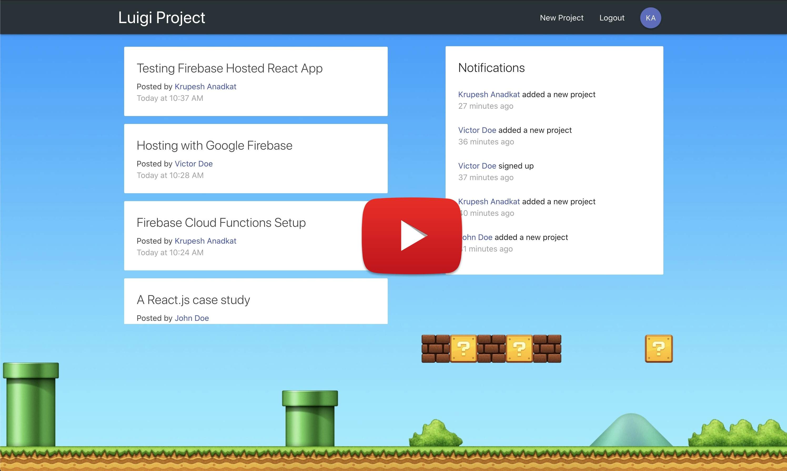

## React Redux with Firebase Full Stack Project

It contains firebase authentication, firestore for storing data & notifications via firebase cloud functions. It is hosted with firebase hsoting. In this project user can Register with email & password. After that user can view dashboard where projects created by all users are visible, one can click project card to see project details in different route. Each time a new user signs up or creates a project then all loggedin users are notified in Notification section of dashboard.

### Project Demo 🎬

### Project Routes ⛳️

1. `/` Dashboard Route
2. `/login` Login Route
3. `/register` Register Route
4. `/create-project` Create New Project
5. `/project/:id` Project Detail Route

**Route Gaurding** or **Route Protection** is in place for all routes, following is the route visibility:

| Normal User                | Authenticated User                   |
|----------------------------|--------------------------------------|
| `/login` Login Route       | `/` Dashboard Route                  |
| `/register` Register Route | `/create-project` Create New Project |
|                            | `/project/:id` Project Detail Route  |

